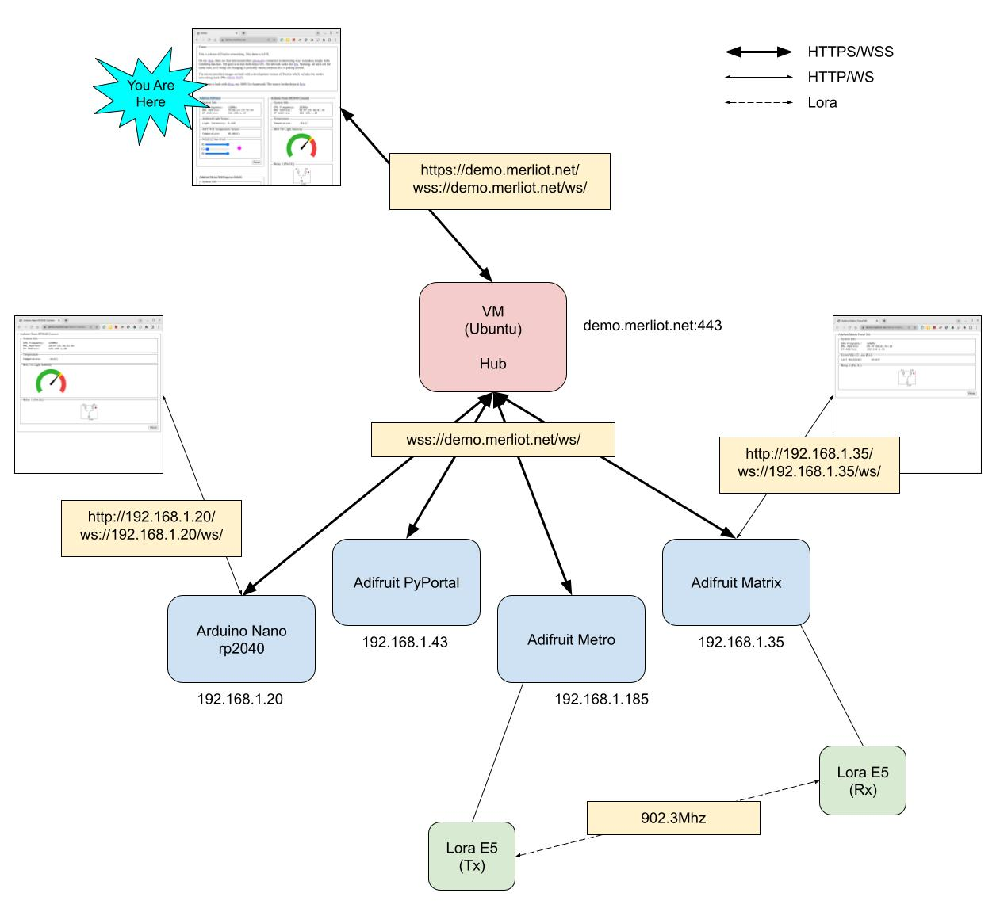

# Dean Demo

[](https://app.koyeb.com/deploy?type=git&repository=github.com/merliot/dean-demo&branch=main&name=demo)

[The demo is [running](https://demo.merliot.net) LIVE]

This is a demo of [Dean](https://github.com/merliot/dean), a Go framework for making things.  It's also a demo of [TinyGo](https://tinygo.org") networking using netdev.

The demo runs on the hardware setup below, sitting on my desk.  (Bunch of parts I had on-hand; hopefully the cat doesn't find it interesting!).


### Parts List

* [Adafruit PyPortal](https://www.adafruit.com/product/4116)
* [Arduino Nano RP2040 Connect](https://docs.arduino.cc/hardware/nano-rp2040-connect)
* [Adafruit Metro M4 Express AirLift](https://www.adafruit.com/product/4000)
* [Adafruit Matrix Portal M4](https://learn.adafruit.com/adafruit-matrixportal-m4/overview)
* [BH1750 Light Sensor](https://www.instructables.com/BH1750-Digital-Light-Sensor/)
* (2) 3v Relays
* (2) [Grove Lora E5](https://www.seeedstudio.com/Grove-LoRa-E5-STM32WLE5JC-p-4867.html)

### Connections

Everything is wired together:


### Network

Here's a network view of the demo.  The VM is a https server and the microcontrollers are http servers.  The microcontrollers connect to the hub over secure websockets.



# Running Demo

(These are notes to myself, mostly)

There are two parts to the demo: a hub running on a VM and the microcontrollers.  The hub is running [cmd/demo/main.go](cmd/demo/main.go).  The microcontrollers are running firmware built with TinyGo.

## Install Hub

The four microcontrollers connect to a hub.  The hub is a webserver and presents a view to the microcontrollers.

I've installed the hub on a VM running on GCP with Ubuntu on the cheapest VM option ($5/month).

```
go install -C cmd/demo
```

Give perms to web serve https on port :443

```
sudo setcap CAP_NET_BIND_SERVICE=+eip ~/go/bin/demo
```

## Run Hub

Run demo as https web server on \<host\> on port :443.

```
~/go/bin/demo -host <host>
```

## Install MicroControllers

### Building Firmware

Buildi/flash the firmware for each target using TinyGo\*:

```
tinygo flash -monitor -target pyportal -stack-size 4KB cmd/pyportal/main.go
tinygo flash -monitor -target nano-rp2040 -stack-size 4kB cmd/connect/main.go
tinygo flash -monitor -target metro-m4-airlift -stack-size 4KB cmd/metro/main.go
tinygo flash -monitor -target matrixportal-m4 -stack-size 4KB cmd/matrix/main.go
```

\* Requires netdev patch to tinygo.
